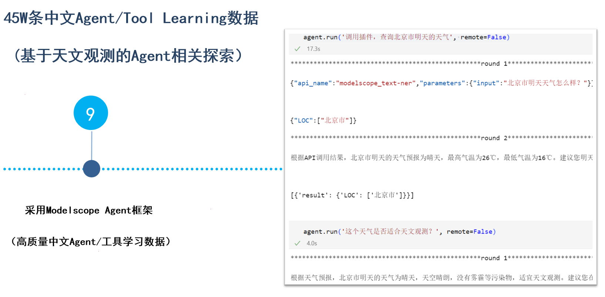
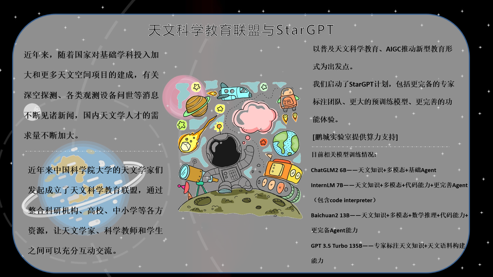

# StarGLM

我们整合了天文科学教育联盟、司天工程、集思谱文献平台相关的语料数据与知识库资料，训练得到了天文大模型StarGLM(ChatGLM for Star)。

以期缓解大语言模型在天文专业的幻觉现象，为接下来可处理天文多模态任务、部署于望远镜阵列的观测Agent——司天大脑（数据智能处理）打下基础。

## 版本更新：
1.通过Tool learning语料训练，提升了模型通过Agent进行工具规划调度与执行回复的能力。

2.公布了上一版本在CG-Eval评测上的结果，天文能力提升明显，数学推理计算得分高于文心一言。
更新后的权重：https://github.com/Yu-Yang-Li/StarGLM/releases/tag/v0.1.3

sft与dpo权重合并后的模型：https://huggingface.co/Yu-Yang-Li/StarGLM
## 功能展示


<br>


<br>


<br>


<br>


<br>


<br>



<br>


<br>


## 安装指南
 
1.基础模型安装（推荐显存>=16G）：

Releases(https://github.com/Yu-Yang-Li/StarGLM/releases/tag/v2.0.0)
Checkpoint.7z存有监督微调和经过DPO的Lora权重，运行时二者合并加载。

也可直接通过transformer库导入使用。

对于精确问答，建议设置temperature=0.01，top_p=0.8。
```python
import sys
from peft import PeftModel
from transformers import AutoModel, AutoTokenizer
sys.path.append('..')
model = AutoModel.from_pretrained("Yu-Yang-Li/StarGLM",  device_map='auto', trust_remote_code=True)
tokenizer = AutoTokenizer.from_pretrained("Yu-Yang-Li/StarGLM", trust_remote_code=True)
sents = ['什么是引力透镜。\n答：']
for s in sents:
    response = model.chat(tokenizer, s, max_length=128, eos_token_id=tokenizer.eos_token_id)
    print(response)
```


2. 加载工具学习权重
https://github.com/Yu-Yang-Li/StarGLM/releases/tag/v0.1.3
，存有工具学习后的Lora权重，运行时需与第一步的基础模型合并加载，具体使用可参考demo_starglm_agent.ipynb。

【经过工具学习语料训练后的版本，对原天文知识有一定灾难性遗忘，下一版本将尝试缓解】

3.链接知识库/StableDiffusion:

建议使用Wenda(闻达)实现，基于StarGLM，能够进行多种天文相关的文本处理、知识库回答、AI绘画等任务。

(注：考虑到版权因素，暂不直接提供知识库文件，经典书籍可参考example/books，感谢张家硕同学提供。变星领域相关知识，将在司天-变星知识图谱完成后一同发布。推荐StableDiffusion使用的基模型与Lora权重见“使用/推荐的相关项目”)
## 司天工程

司天工程是我国天文学家面向时域天文学所提出的“十五五”天文重大基础设施，一期计划在国内多个优选观测台址布置54台（18组）口径1米级的大视场望远镜，组成多波段同时监测网络，每30分钟完成1万平方度天区的高精度三色“凝视”巡天。司天的采样频率比全球其它巡天项目高近两个量级，将突破目前探测时标的限制，在新的空域和时域下发现大批新天体、新现象，在宇宙极端高能爆发源、引力波电磁对应体、系外行星和太阳系天体等理论和观测研究中形成新的突破，在“两暗一黑三起源”等重大科学问题研究以及地球文明灾难预警等国家空间安全问题方面发挥重要作用。


其中司天"大脑"作为数据智能处理中枢，需要适配于天文的AI工具。StarGLM作为其备选方案，在使用大模型整合天文知识的同时，探索多模态解决具体天文问题的可能性。
## 许可证信息

项目源码遵从Apache-2.0 license，ChatGLM2-6B的模型权重使用需遵从相应许可。

## 使用/推荐的相关项目

- THUDM/ChatGLM2-6B: ChatGLM2-6B: An Open Bilingual Chat LLM | 开源双语对话语言模型 (github.com) 
- wenda-LLM/wenda: 闻达：一个LLM调用平台。目标为针对特定环境的高效内容生成，同时考虑个人和中小企业的计算资源局限性，以及知识安全和私密性问题 (github.com) 
- THUDM/VisualGLM-6B: Chinese and English multimodal conversational language model | 多模态中英双语对话语言模型 (github.com) 
- hiyouga/ChatGLM-Efficient-Tuning: Fine-tuning ChatGLM-6B with PEFT | 基于 PEFT 的高效 ChatGLM 微调 (github.com)
- rexwang8/stellar-diffusion · Hugging Face
- 光芒-极光｜LiblibAI
- dallinmackay/JWST-Deep-Space-diffusion · Hugging Face
- MeteorCollector/iris_AstroQnA_ZH: Astronomy Q-A pairs in simplified Chinese. (github.com)
- HIT-SCIR/huozi (github.com)
- Instruction-Tuning-with-GPT-4/GPT-4-LLM: Instruction Tuning with GPT-4 (github.com)
## To do list

### 大语言模型（科普方式）

- [ ]  在相关材料上进行二次预训练，扩充天文知识。
- 调整监督微调中，通用数据和专业数据的比例，缓解灾难性遗忘问题。
- 通过人工反馈的强化学习，进一步提升模型性能。
- 通过特定数据集微调，提升模型总结能力，进一步适配知识库。
- [ ]  完成司天-变星知识图谱，与模型链接，进一步降低变星领域的幻觉现象。

### 专业多模态（科研工具）

- [ ]  开源在变星光变曲线上训练的VisualGLM微调权重。
- [ ]  进一步探索多模态模型在天文图像生成与识别上应用的可能性。


### 观测Agent（司天大脑）

- [ ]  结合CodeGeeX2-6B工作，提升模型在天文领域的编程能力。
- [ ]  在MiniSiTian/司天样机上，进行与天文环境交互的Agent探索工作。
- 考虑通过工具学习，链接天文专业工具。
- 尝试Agent相关工作，验证作为司天大脑备选方案的可行性。

## 引用
如果这篇工作对你有帮助，请引用：

@Misc{chatglm-for-variable-star,

  title = {StarGLM},
  
  author = {YuYang Li, CunShi Wang, MengWei Qu, Yu Bai, Roberto Soria, JiFeng Liu},
  
  howpublished = {\url{https://github.com/Yu-Yang-Li/StarGLM}},
  
  year = {2023}
  
}
