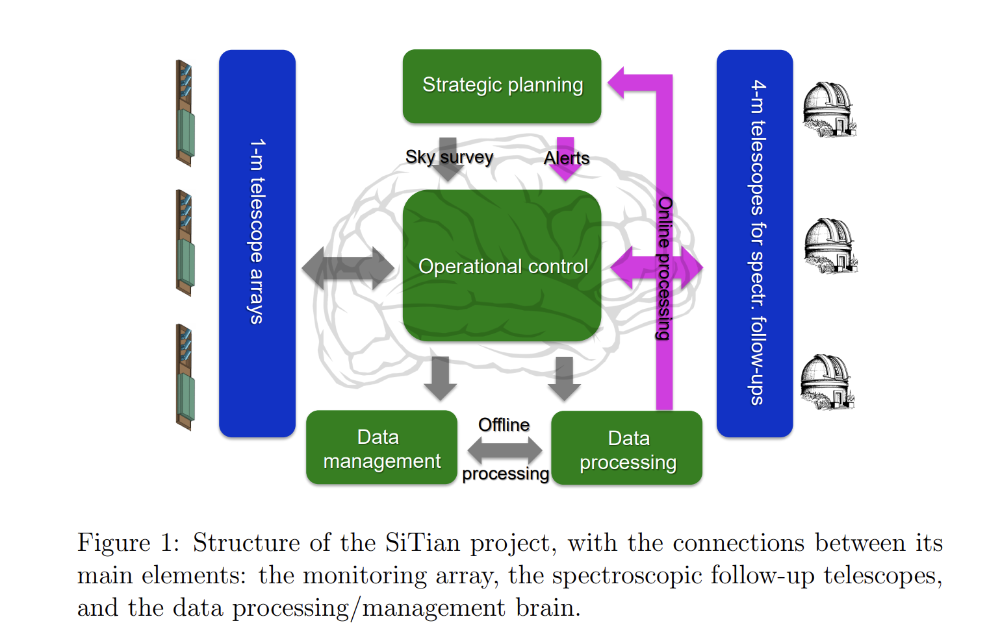

# StarWhisper

\[ English | [中文](README.md) \]

With the support of the Astronomical Science Education Alliance, the Giiisp Literature Platform, and the SiTian Project, based on the development experience of StarGLM, we further trained the StarWhisper series models (including 6B, 7B, 13B, 14B, 20B).

To further alleviate the hallucination phenomenon of LLM in astronomy, laying the foundation for the following handling of astronomical multimodal tasks and the deployment of scientific embodied intelligence in telescope arrays - the SiTian Brain.

## Version: 

1. Through dataset cleaning and retraining, the catastrophic forgetting of previous knowledge after training with Agent/tool learning has been alleviated, significantly improving mathematical reasoning and coding capabilities. A series of problems can be solved through code interpreters.

2. The results of the current version on CG-Eval are published, with a total ranking of second only to GPT-4, and mathematical reasoning and astronomical ability close to or exceeding GPT 3.5 Turbo.

CG-Eval：http://cgeval.besteasy.com/leaderboard.html

updated checkpoint：https://github.com/Yu-Yang-Li/StarGLM/releases/tag/v0.2.0

model after merged：https://wisemodel.cn/models/LiYuYang/StarWhisper

## Introduction

## Installation(Recommended Memory >= 24G)

Releases store both supervised fine-tuned and DPO checkpoints, which should be loaded together at runtime.

You can also directly download the model weights through the AI-wisemodel platform and load them.

SiTian is an ambitious ground-based all-sky optical monitoring project, developed by the Chinese Academy of Sciences. The concept is an integrated network of dozens of 1-m-class telescopes deployed partly in China and partly at various other sites around the world. The main science goals are the detection, identification and monitoring of optical transients (such as gravitational wave events, fast radio bursts, supernovae) on the largely unknown timescales of less than 1 day; SiTian will also provide a treasure trove of data for studies of AGN, quasars, variable stars, planets, asteroids, and microlensing events. To achieve those goals, SiTian will scan at least 10,000 square deg of sky every 30 min, down to a detection limit of  V≈21
  mag. The scans will produce simultaneous light-curves in 3 optical bands. In addition, SiTian will include at least three 4-m telescopes specifically allocated for follow-up spectroscopy of the most interesting targets. We plan to complete the installation of 72 telescopes by 2030 and start full scientific operations in 2032.

##License

The source code of the project complies with the Apache-2.0 license, and the model of ChatGLM2-6B, Qwen-14B Chat use will comply with the corresponding license.

## Used/Recommend Related Projects

- THUDM/ChatGLM2-6B: ChatGLM2-6B: An Open Bilingual Chat LLM | 开源双语对话语言模型 (github.com)
- qwen/Qwen-14B-Chat: 通义千问-14B（Qwen-14B） 是阿里云研发的通义千问大模型系列的140亿参数规模的模型。
- wenda-LLM/wenda: 闻达：一个LLM调用平台。目标为针对特定环境的高效内容生成，同时考虑个人和中小企业的计算资源局限性，以及知识安全和私密性问题 (github.com) 
- THUDM/VisualGLM-6B: Chinese and English multimodal conversational language model | 多模态中英双语对话语言模型 (github.com) 
- hiyouga/ChatGLM-Efficient-Tuning: Fine-tuning ChatGLM-6B with PEFT | 基于 PEFT 的高效 ChatGLM 微调 (github.com)
- rexwang8/stellar-diffusion · Hugging Face
- 光芒-极光｜LiblibAI
- dallinmackay/JWST-Deep-Space-diffusion · Hugging Face
- MeteorCollector/iris_AstroQnA_ZH: Astronomy Q-A pairs in simplified Chinese. (github.com)
- HIT-SCIR/huozi (github.com)
- Instruction-Tuning-with-GPT-4/GPT-4-LLM: Instruction Tuning with GPT-4 (github.com)
## To do list

### Large Language Models (Popularization)

- [ ] Continue pre-training on related materials to expand the astronomical knowledge 
- Adjusting the ratio of general and specialized data in supervised fine-tuning, alleviating the catastrophic forgetting problem. 
- Reinforcement learning through artificial feedback further improves model performance. 
- By fine-tuning on specific datasets, the model's ability to summarize is enhanced, further adapting to the knowledge base. 
- [ ] Complete the SiTian knowledge graph, link it with the model, and further reduce the hallucination phenomenon in the Relevant field.

### Professional Multimodal (Research Tool)

- [ ]  Further explore the possibility of applying multimodal models in astronomical image generation and recognition.

### Embodied Intelligence (SiTian Brain)

- [ ]  Enhance the programming capability of the model in the field of astronomy.
- [ ]  Agent exploration on MiniSiTian, agent interacts with the astronomical environment.
- Learning to link astronomical tools through tool learning.

## Citations
If this work is helpful to you, please cite:

@Misc{chatglm-for-variable-star,

  title = {StarGLM},
  
  author = {YuYang Li, CunShi Wang, MengWei Qu, Yu Bai, Roberto Soria, JiFeng Liu},
  
  howpublished = {\url{https://github.com/Yu-Yang-Li/StarGLM}},
  
  year = {2023}
  
}

## Star History

